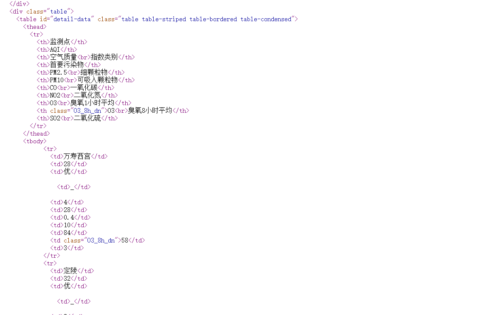

# 练习 1 - 数据清理 

### 数据：

p1_pm25.dta

### 任务简介：

这是北京某天PM2.5检测数据网页的源代码。你需要做的是将这个源代码整理成可以用的数据格式。

也就是将这个：

整理成这样：

### 步骤：

1. 把变量 v 显示的长度拉长点，不然都看不清里面的东西是啥。
2. 保留有用的行。
3. 将数据整理出来，剔除html标记（利用reshape来整理）
4. 将变量转为数值型变量

### 基本技能：

文本型变量格式调整、数据形状转换、文本替换、数据类型转换

### 进阶技能：

正则表达式、数据压缩、变量列表（_all）、capture 命令