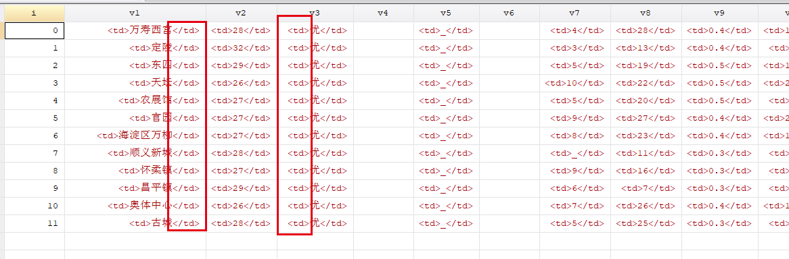
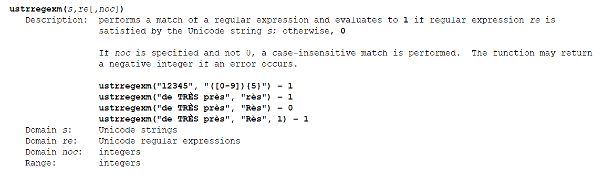
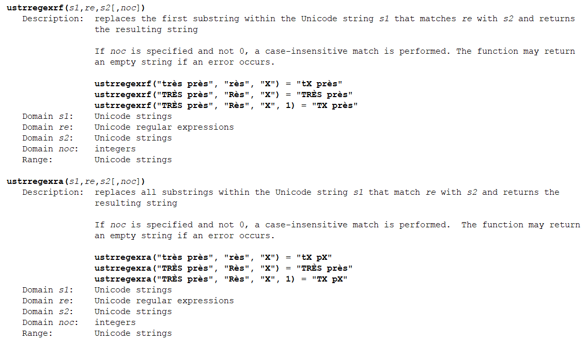
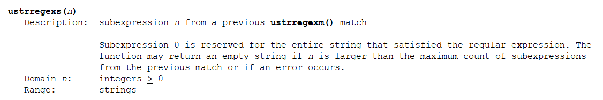
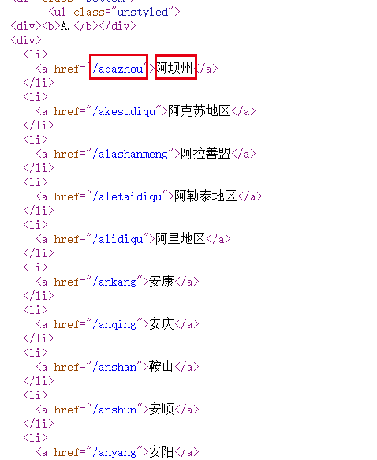
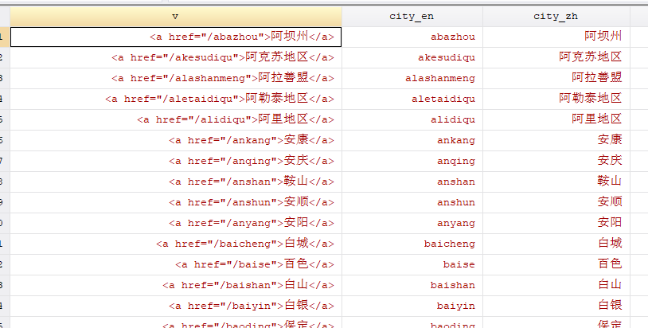

# 练习 2 - 正则表达式

### 数据：

p2_reg.dta


### 任务简介：

书接上回，我们需要将数据中的html标记清除：



这里就可以有两种方法，最基本的方法就是利用Stata的文本替换函数：

```Stata
reshape wide v , i(i) j(j)
compress

foreach var of varlist _all {
	cap replace `var' = subinstr(`var',`"<td class="O3_8h_dn">"',"",1) 
	cap replace `var' = subinstr(`var',"<td>","",1) 
	cap replace `var' = subinstr(`var',"</td>","",1)
	destring `var' , replace
}
```

另一种方法就是在reshape之前就利用正则表达式将这些标记去掉，代码就可以精简很多：

```Stata
replace v = ustrregexra(v,`"<td>|</td>|<tr>|</tr>|<td class="O3_8h_dn">"',"")
reshape wide v , i(i) j(j)
```

正则表达式（英语：Regular Expression，常简写为regex、regexp或RE），又称正则表示式、正则表示法、规则表达式、常规表示法，是计算机科学的一个概念。正则表达式使用单个字符串来描述、匹配一系列符合某个句法规则的字符串。许多程序设计语言都支持利用正则表达式进行字符串操作。

Stata的正则表达式功能在string function里面，每次用的时候在help-file找一下就好。Stata内置的函数有以下的功能：

查看是否满足条件：



替换功能：



提取功能：



**正则表达式的教程参考这个：**https://deerchao.net/tutorials/regex/regex.htm

**这个是正则表达式的测试工具（用来看你的表达式写的正不正确）：**http://tool.chinaz.com/regex/

所以这次的任务是，利用正则表达式来提取网页源代码的信息。这是全国各个城市PM2.5检测数据的目录页（http://www.pm25.in/），我们要从他的源代码中提取城市名称和超链接的网址（在浏览器右键检查就可以查看网页源代码）：



### 步骤：

1. 整理数据，保留有用部分。

2. 利用正则表达式提取需要的信息，将提取的内容新建为两个变量（如：city_en,
   city_zh）。

   
